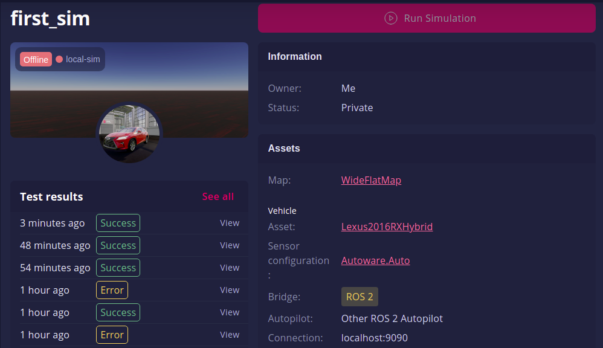
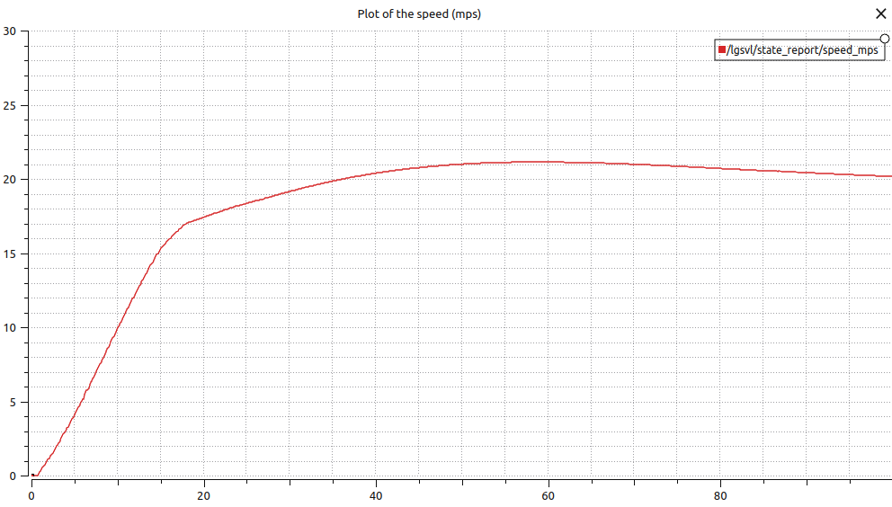
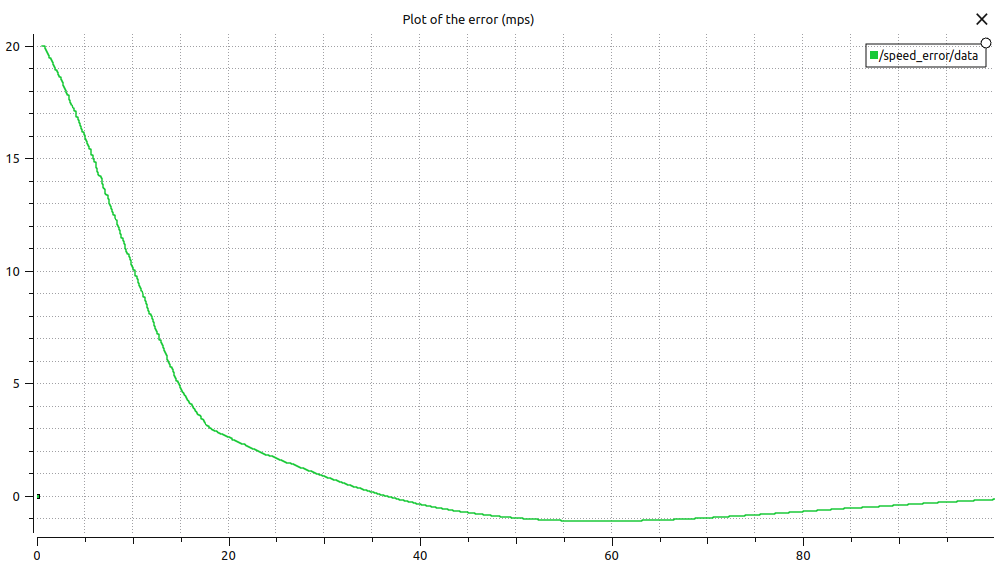
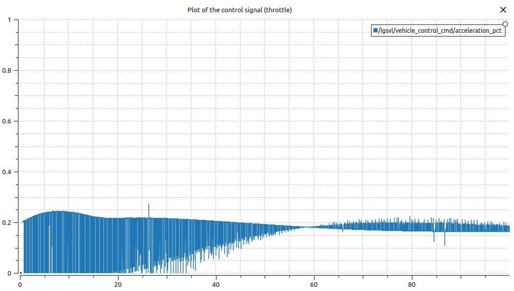

# Procedure

## Simulation Environment



## Code

controller.cpp: 

In this file, a class which inherits from rclcpp::Node is created with the name of PubSub. The PubSub class is used to implement a ROS2 publisher and subscriber. The publisher publishes the control signal to the topic /lgsvl/vehicle_control_cmd into the field acceleration_pct of the topic message (which is assumed to be the throttle). Additionally, there is another publisher which publishes the error signal into a new topic called /speed/error to be evaluated later in PlotJuggler. Also, there is a subscriber which subscribes to the topic /lgsvl/state_report in order to get information about the current speed of the vehicle which is found as the speed_mps field of the message. This speed information is used as the feedback in the controller.

PIDcnt.hpp:

This C++ header file is used to define the PIDcnt class. When using this PID class, the proportional gain (kp), integral gain (ki), derivative gain (kd), sampling time (ts), and saturation limits (low and high) can be set using the constructor of the class.

## Controller Considerations

A speed reference in m/s is defined as a global variable (double ref). The obtained speed feedback (speed_mps) is subtracted from the reference in order to calculate the speed error. The PID controller takes the error as the input and then outputs the control signal which is the throttle.

```
message.acceleration_pct = pid.Compute(ref-speed);

```
The publishing rate of the control signal publisher is chosen as 1ms which is the sampling time of the controller.

Additionally, upper and lower saturation limits are defined for the control signal of the controller in order to make sure that the throttle signal stays within 0-1.

## Running the package

The lgsvl bridge needs to be started first in order to get the ROS2 topics:

```
lgsvl_bridge

```

Then the controller can be activated using the following command:

```
ros2 run long_vehicle_cnt controller

```

## Results  

As a test trial, the speed reference is chosen as 20 m/s.







## Comments

As shown in the third plot, the availabe range for the control signal (0-1) is not fully taken advantage of which means that the PID parameters could be increased further. However, increasing the PID paramters introduces undesirable overshoot and undershoot in the speed response of the system.